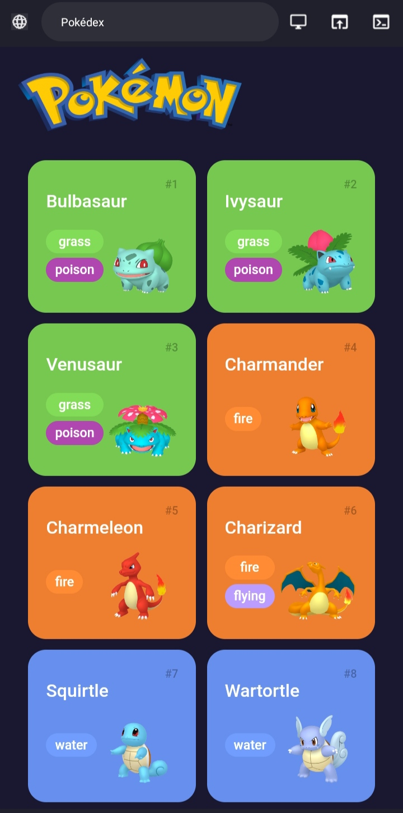
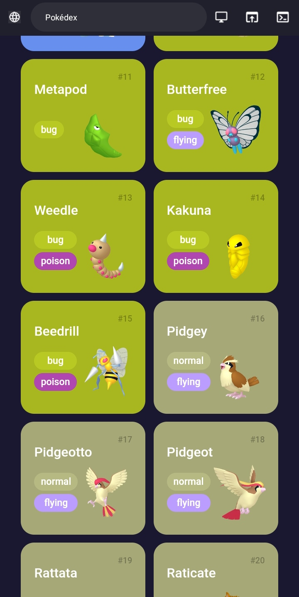
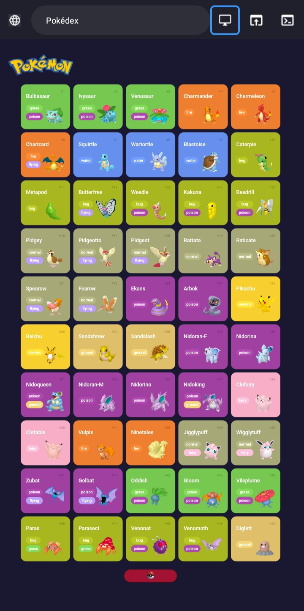

 

Desenvolvido durante março/abril de 2023 com foco no aprendizado da linguagem JavaScript e para fortalecer ainda mais minhas habilidades técnicas 🚀⚡.  

- [Overview](#overview)
  - [Sobre o projeto](#sobre)
  - [Screenshots](#screenshots)
  - [Links](#links)
- [My process](#my-process)
  - [Desenvolvido com](#tecnologias)
  - [Continuar o desenvolvimento](#continuar-o-desenvolvimento)
  - [Recursos úteis](#recursos-úteis)
- [Author](#autor)

 

## Overview
### Sobre
O que seria uma Pokédex? Pokédex é uma enciclopédia virtual que detém todas as espécies de Pokémon, ou seja, desde a 1° geração até a última geração. Olhando esse detalhe percebe-se que demandaria muito tempo para pegar o nome, tipo/classe e habilidades de cada Pokémon um por um escrevendo várias linhas de código, isso seria nada produtivo e nem tampouco divertido. Nesse momento entra o API (Application Programming Interface). Ele promove a conexão entre um usuário e uma aplicação, mas sem que ele precise dos detalhes da estrutura e do desenvolvimento do sistema que está tentando utilizar. e o que seria REST? A categoria REST apresenta alguns critérios específicos, que visam padronizar e flexibilizar essa comunicação entre diferentes plataformas. No caso deste projeto foi "consumido" o PokéApi, um API RESTful com várias informações e dados sobre Pokémons, para facilitar o processo de desenvolvimento da Pokédex. Foi criado um efeito de paginação, ou seja, ao iniciar é chamado 10 pokémons, se clicar no botão ele traz +10 e assim vai até o limite configurado que é 151 (Que pode ser alterado no arquivo main.js).

### Screenshots

  

  

  

  

### Links
- [Acesse o projeto finalizado, online ☁️](https://joaoalisonti.github.io/Pokedex-Js/)

 

## My process
### Tecnologias
### ⚙️👨‍💻
Esse projeto foi desenvolvido com as seguintes tecnologias:

- HTML
- CSS
- JavaScript
- API REST
- Git/Github

### Continuar o desenvolvimento
Pretendo adicionar um elemento de pesquisa para buscar e fazer a filtragem dos Pokémons. Além de pegar mais informações dos Pokémons e adicioná-las a Pokédex.

### Recursos úteis
- [PokéApi](https://pokeapi.co/docs/v2) - A PokéAPI é gratuita e aberta para uso. Também é muito popular e é principalmente uma ferramenta educacional.
- [Introdução às Web APIs](https://developer.mozilla.org/pt-BR/docs/Learn/JavaScript/Client-side_web_APIs/Introduction) - O que são, como funcionam, como usá-las em seu código e como são estruturadas? Ainda, entender quais são as principais classes de APIs e quais usos elas possuem.
- [API REST: o que é e como montar uma API sem complicação?](https://blog.betrybe.com/desenvolvimento-web/api-rest-tudo-sobre/#:~:text=API%20REST%20serve%20para%20a,forma%20ass%C3%ADncrona%20entre%20diversas%20aplica%C3%A7%C3%B5es.) - Este artigo fornece sobre que é API REST,
qual a relação entre HTTP e REST,
entender as diferenças entre SOAP e REST. Para que serve o API REST e suas principais aplicações!
- [Como usar a Fetch API do JavaScript para buscar dados](https://www.digitalocean.com/community/tutorials/how-to-use-the-javascript-fetch-api-to-get-data-pt) - O JavaScript tem sua própria maneira integrada de fazer solicitações de API. Isso é feito pela Fetch API, um novo padrão para fazer solicitações de servidor com promessas, que inclui também muitas outras funcionalidades.
- [Fetch API – como fazer solicitações GET e POST em JavaScript](https://www.freecodecamp.org/portuguese/news/fetch-api-como-fazer-solicitacoes-get-e-post-em-javascript/amp/) - O JavaScript tem sua própria maneira integrada de fazer solicitações de API. Isso é feito pela Fetch API, um novo padrão para fazer solicitações de servidor com promessas, que inclui também muitas outras funcionalidades.

 

## Autor
*João Alison TI 👨🏽‍💻*

---

<strong>2023</strong>